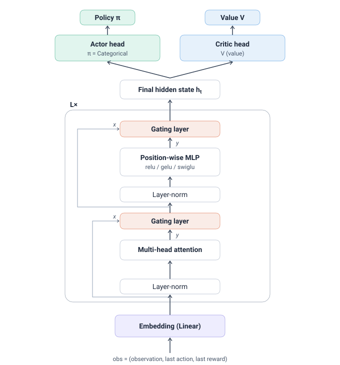

# TPPO: Transformer Policies for Continual Reinforcement Learning

  

An implementation of a Transformer-based actor-critic trained with Proximal Policy Optimization (PPO), built in JAX and Flax NNX, for experiments in continual reinforcement learning paradigms.

In a continual RL setting, an agent lives in one long, non-stationary stream of experience, so what it can remember about the recent past becomes part of the policy itself. This project replaces the usual MLP or recurrent policy with a Transformer whose attention window is the agent's memory, and studies the performance against Recurrent Trace Units (RTU-PPO) and classic PPO. 

## Environment Setting 
The environments used to evaluate agent performance are non-stationary and partially observable continual environments. The agent is tasked with collecting mushrooms with distinct reward values in a grid-based map with a limited field of view, this is what introduces partial observability. 

Over time, a portion of the environment will switch (non-stationarity). In some cases, the distribution of mushrooms spawned in certain biomes will switch. In others, the reward values of different mushrooms will change. 

## Architecture Diagram 

## References

These were the papers I've read to try an improve the performance of TPPO.

- Schulman et al. (2017), [*Proximal Policy Optimization Algorithms*](https://arxiv.org/abs/1707.06347)

- Parisotto et al. (2019), [*Stabilizing Transformers for Reinforcement Learning*](https://arxiv.org/abs/1910.06764)

- Ainslie et al. (2023), [*GQA: Training Generalized Multi-Query Transformer Models*](https://arxiv.org/abs/2305.13245)

- Shazeer (2020), [*GLU Variants Improve Transformer*](https://arxiv.org/abs/2002.05202)
